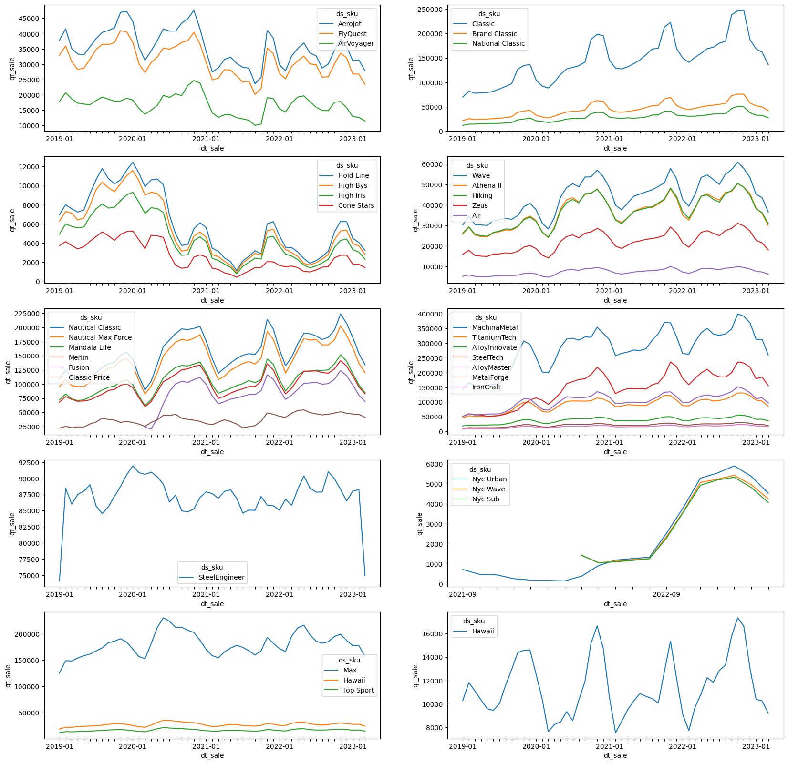
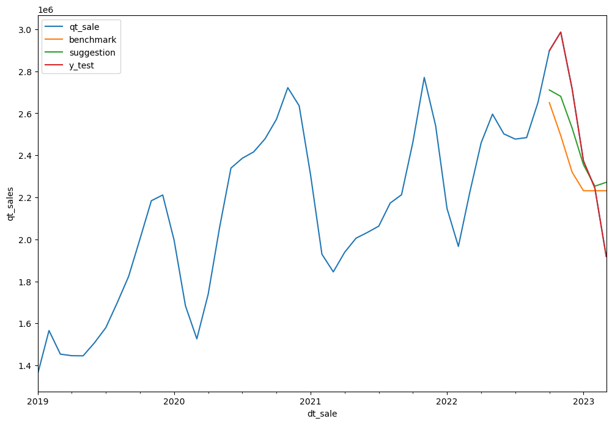

# VAI Conecta

VAI Academy is a Brazillian Edtech e HR tech. It was born from a dream: train Artifical Intelligence (AI) and Advanced Analytics talents, and help them become leaders to make a difference in companies and for society. VAI Academy is part of of Visagio, a strategic consultant group from Rio de Janeiro and currently (2023) present in 30 countries, helping clients in different sectors, such as: finance services, retail and engineering.

## Case explanation

VAI Shoes is a shoes company with a high growth rate. Because it operates in a highly competitive space, the best way to improve it's profitability is through the improvement of the Sales and Operations Planning (S&OP) forecasts. With this in mind, the guiding questions for the project are:

1. How is the forecast built?
2. Is the new forecasting method better than the current one?
3. Which products have the best and worse forecasts?
4. If it was possible to include other variables, what should be included?
5. What are the next steps for the project?

### Data

The description of each file can be seen below. Both files were stored in Git LFS and are inside `data/` folder.

To download the data after cloning this repo, simply run `git lfs checkout`

#### Sales History

File: `tbl_vendas_mensais.csv`
Description: Monthly sales of each SKU

| coluna           | chave    | informação                | tipo    |
|------------------|----------|---------------------------|---------|
| dt_sale primária | primária | Mês e Ano da venda        | Data    |
| id_sku           | primária | Id do SKU                 | Inteiro |
| ds_sku           | -        | Descrição do SKU          | String  |
| ds_category      | -        | Categoria do SKU          | String  |
| ds_product_line  | -        | Linha de produtos do SKU  | String  |
| ds_brand_segment | -        | Segmento da marca do SKU  | String  |
| ds_tecnology     | -        | Tecnologia do SKU         | String  |
| qt_sale          | -        | Quantidade Vendida no Mês | Inteiro |
| vl_sale_price    | -        | vendido no mês (R$)       | Float   |

#### Benchmark Prediction

File: `tbl_previsao_sop.xlsx`
Description: Demand forecast of M+0 to M+3 executed by the S&OP team for each product line

| coluna                       | chave     | informação                                                                         | tipo   |
|------------------------------|-----------|------------------------------------------------------------------------------------|--------|
| dt_sale                      | primária  | Mês e Ano da venda                                                                 | Data   |
| ds_product_line              | primária  | Linha de produtos do SKU                                                           | String |
| qt_sale_sop_forecasting_ m1  | -         | Quantidade de venda prevista  para o mês, em M-1 (1 mês  antes da data da venda)   | Float  |
| qt_sale_sop_forecasting_ m2  | -         | Quantidade de venda prevista  para o mês, em M-2 (2 meses  antes da data da venda) | Float  |
| qt_sale_sop_forecasting_ m3  | -         | Quantidade de venda prevista  para o mês, em M-3 (3 meses  antes da data da venda) | Float  |

### Exploratory Analysis

The demand time series seem to be groupable as follows:



- [ ] Calculate correlation between time series to validate hypothesis

Following their behavior, it is clear that most have a strong sazonality component, while others have trend. It is also important to notice that these series have different lenghts.

Finally, their behaviour seems normally distributed, which is important for many of the methods that were explored during the modelling class.

### Modelling

The current benchmark is a moving average of the last three months. This has been implemented in `src/model/notebook.ipynb` with a `MovingAverage` estimator and `Naive` model.

The following ideas seem applicable:

- [x] Use a Naive model to calculate the average between the seasonal lag (12) and the autoregressive value (last known value)
  - This has been tested and shown to beat (MAE) the benchmark in approximately 70% of the series

- [x] Estimate a LinearRegression instead of averaging both values
  - This has been tested, but has not shown as good results.
- [x] Combine the Moving Average with the Seasonal Lag (e.g. `SARIMA(1, 0, 3)(1, 0, 0, 12)`)

#### Guiding Questions

The main questions to be answered are:

1. What is the forecasting method?

Because of the limited time, the effort was mainly put in analysing the data and extracting insights. From there we recognized that some values were duplicated; resulting in them being treated by mean aggregation.

2. Is it better than the moving average?

Moving Averages are easy to implement and tend to show good results. Unfortunately, this is not true if the series has a high explainable variance by factors such as sazonality. Therefore, it is expected that series with high sazonality can have their forecasts improved; but this is not expected for other series.

3. What is the hardest product to forecast?

The hardest product to forecast is a product that resembles white noise.

Forecasts are evaluated with Mean Absolute Error (`MAE`), as that is a simple metric regarding whole products.

1. What are the next steps?

Because of how the market is positioned, having too much shoe stock is terrible due to warehousing, but being too lean might result in lost sales. Therefore, the next steps are related to estimating the best security stock. An easy option as benchmark is using the train standard deviation as a risk measurement, and stocking, for example, 2 deviations.

#### Challenges

An important challenge is the number of series, which brings different patterns and different lenghts; making applying any model in a programatic way a challenge.

Related to the challenge above, comparing models is also difficult, especially if the comparison strategy is not well defined. Therefore, having a fast evaluation benchmark is also very necessary.

#### Initial Solution

For an initial solution, the objective is to show that the seasonal component should be considered. For that, two models were used:

- `benchmark`, a moving average model, implemented via `SARIMAX(0, 0, 3)(0, 0, 0, 12)("c")`
- `seasonal`, an airline seasonal model, implemented via `SARIMAX(1, 0, 1)(1, 0, 0, 12)("c")`

It is important to note, as can be seen in [`./src/model/notebook.ipynb`](./src/model/notebook.ipynb), that some of the models have not converged, so a further study should be done.

However, the results were still better than the `benchmark` used by the S&OP team. To illustrate that, the aggregated result is shown below:



Another improvement to be made is to consider the best models for summing them, instead of summing only `benchmark` and only `seasonal`.

#### Next Steps

There are three important next steps:

- Calculate the ACF and PACF for each SKU and correlate them with the objective of confirming the hypothesis that some series are very closely related - which could allow an aggregated forecast;
- Use the model residues to calculate a security stock to be kept in the warehouse, because the lost sale cost is much greater than the warehouse costs; and
- Explore time series hierarquical models, which will make requests agree when summed up.

## Troubleshooting

### Creating an Anaconda Environment

The easiest way to run this project is to clone this repository and create a virtual environment with `conda`, as follows:

```bash
git clone https://github.com/felipewhitaker/vai-conecta.git
conda create --prefix .conda --file requirements.txt
```

### Project Requirements

`requirements.txt` is available on the root of this project.

```bash
conda list -e > requirements.txt
```